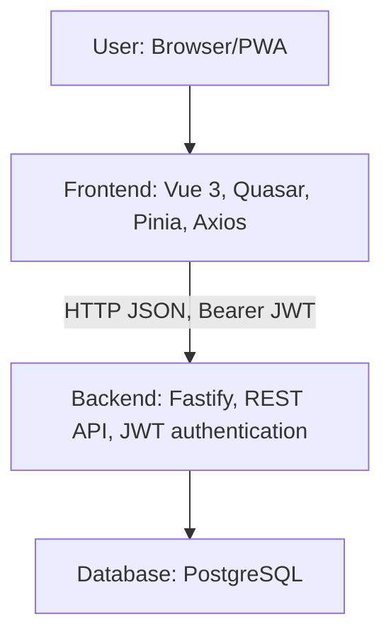

# goals-vue

Vue frontend for [lifetrackerbuddy.com](https://lifetrackerbuddy.com/), an application to manage [OKRs](https://wikipedia.org/wiki/Objectives_and_Key_Results). It is an advanced task manager with main focus on the goal, goal achievement, and current progress. It should answer the question: _"How far am I away from achieving my goals?"_ Paired with the [Fastify backend](https://github.com/konskarz/goals-fastify).

## Overview




## Features

- Progressive Web App
- Authentication
- Tasks and goals management
- Reports for recurring tasks
- Automatic build and deployment to [GitHub Pages](https://konskarz.github.io/goals-vue)
- Demo user account for exploring the app without registration

## Details

- Domain-first state management keeps task and goal logic (reporting, recurring tasks, scheduling) in stores with inter-store integrations
- Shared utilities provide consistency by unifying CRUD, caching, and change detection
- Integrated reporting logic computes recurring-task metrics within the stores
- Calendar utilities serve as a single source for week/day boundaries, task grouping, and series generation for reports
- Separation of domain and presentation ensures views focus on layout and interaction while stores handle behavior
- Navigation structure supports nested routes, hash-based history, and authentication guards
- Tasks are organized in week-based layouts with drag-and-drop rescheduling and interactive progress tracking
- Goals are modeled hierarchically with inline progress indicators for targets and recurring performance
- Reports provide week-by-week performance heatmaps for recurring tasks
- PWA support includes offline caching of static assets and automatic service worker updates

## Setup

```sh
npm install
npm run dev
```

- Compile and Minify for Production: `npm run build`
- Lint with [ESLint](https://eslint.org/): `npm run lint`
- Customize configuration: see [Vite Configuration Reference](https://vitejs.dev/config/)

## Deploy

Clone production branch: `git clone -b gh-pages https://github.com/konskarz/goals-vue.git vue`
